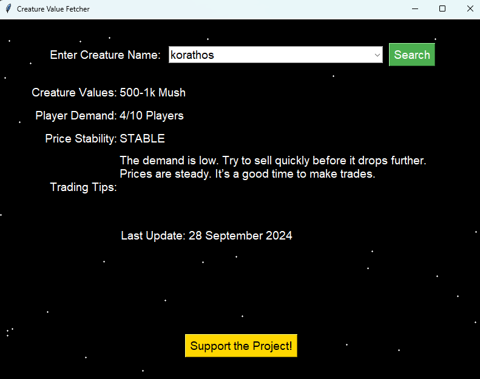

# Creature Value Fetcher

This project is a **Creature Value Fetcher** built using Python and Tkinter. The application fetches values, demand, and price stability for creatures in the game *Creatures of Sonaria* from the [game.guide website](https://www.game.guide/) and displays the information in a user-friendly GUI.

Additionally, the application features an animated "mouse-to-lines connect" style background for a modern and engaging look.

## Features

- **Fetch Creature Data**: Retrieves the following information:
  - Creature Value (in Mush).
  - Player Demand (e.g., `5/10 Players`).
  - Price Stability (e.g., `STABLE`).
- **Animated Background**: Displays moving particles that connect dynamically to create a visually pleasing animation.
- **Intuitive Interface**: Simple input and output sections for quick access to creature data.
- **Trading Tips**: Provides tips based on the combined demand and stability to help users make trading decisions.

## Installation

### Prerequisites

- Python 3.6+
- The following Python libraries:
  - `requests`
  - `bs4` (BeautifulSoup)
  - `tkinter` (built-in for Python on most systems)

Install missing libraries using pip:

```bash
pip install requests beautifulsoup4
```

### Clone the Repository

```bash
git clone https://github.com/yourusername/creature-value-fetcher.git
cd creature-value-fetcher
```

## Usage

1. **Run the Script**:

   ```bash
   python creature_value_fetcher.py
   ```

2. **Enter Creature Name**:
   - Type the name of the creature you want to search for in the input box.

3. **View Results**:
   - The app will display:
     - **Creature Value** (e.g., `3k-5k Mush`)
     - **Demand** (e.g., `5/10 Players`)
     - **Price Stability** (e.g., `STABLE`)

## Code Structure

### Main Functions

1. **`fetch_creature_details(creature_name)`**:
   - Scrapes the website to fetch the creature's value, demand, and price stability.

2. **`display_results()`**:
   - Fetches and updates the displayed results based on user input.

3. **`AnimatedBackground` Class**:
   - Manages the particle animation for the background.

### GUI Components

- **Input Box**: Allows users to enter the creature name.
- **Search Button**: Triggers the fetch operation.
- **Result Boxes**: Displays creature value, demand, and stability.

### Animated Background

- Uses the `Canvas` widget to create particles and lines.
- Dynamically updates positions and connections of particles for a smooth effect.

## Demo



## Contributing

1. Fork the repository.
2. Create a new branch:

   ```bash
   git checkout -b feature-name
   ```

3. Commit your changes:

   ```bash
   git commit -m "Add new feature"
   ```

4. Push the changes:

   ```bash
   git push origin feature-name
   ```

5. Submit a pull request.


---

**Enjoy fetching creature values with style! 🎉**
Donation are not necessary but appreciated / taking ingame items such as mush, creatures and stuff.
Made by Emily / Roblox Name: @yieslie / yeslie with ❤️
